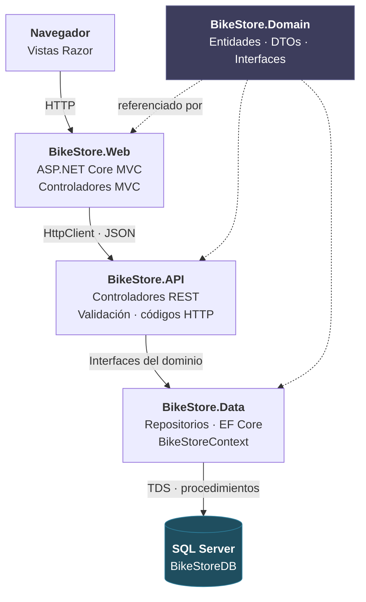
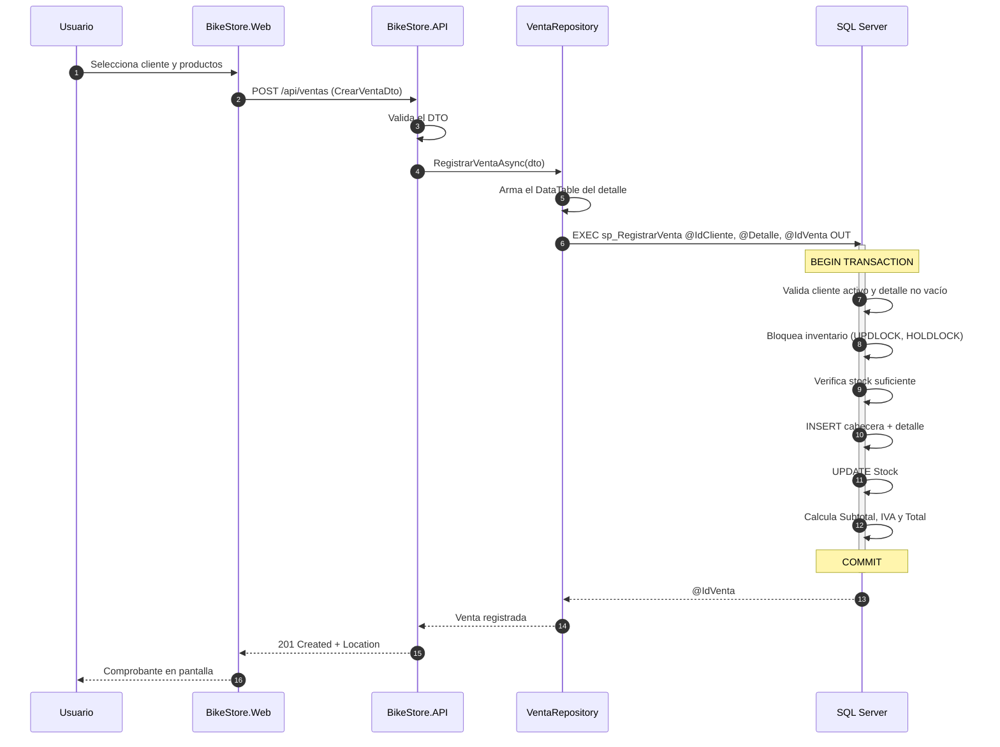

# Arquitectura de Datos — BikeStore

**Responsable:** Ledesma Rodríguez Josué David — *Base de datos / Arquitectura de datos / Integración*

Este documento explica cómo viaja un dato desde el navegador hasta SQL Server y de vuelta, y por qué la solución está partida en esas capas y no en otras.

---

## 1. Arquitectura por capas



| Capa | Proyecto | Responsabilidad | De qué **no** se encarga |
|---|---|---|---|
| Presentación | `BikeStore.Web` | Vistas Razor, formularios, consumo de la API por HTTP. | No conoce la cadena de conexión ni toca SQL Server. |
| Servicios | `BikeStore.API` | Endpoints REST, validación de entrada, traducción de errores a códigos HTTP. | No escribe SQL. |
| Acceso a datos | `BikeStore.Data` | `BikeStoreContext`, repositorios, ejecución de procedimientos almacenados. | No decide reglas de negocio ni formatos de respuesta. |
| Dominio | `BikeStore.Domain` | Entidades, DTOs e interfaces de repositorio. | No depende de ninguna otra capa. |
| Persistencia | `BikeStoreDB` | Integridad referencial, transacciones, reglas que no se pueden violar. | — |

**La dependencia apunta hacia adentro.** `Domain` no referencia a nadie; `Data` y `API` dependen de `Domain`, nunca al revés. Por eso los controladores reciben `IBicicletaRepository` y no `BicicletaRepository`: la API no sabe si detrás hay Entity Framework, ADO.NET o datos en memoria. Cambiar la implementación de la capa de datos no obliga a tocar un solo controlador.

---

## 2. Recorrido completo: registrar una venta



**Si algo falla**, por ejemplo no alcanza el stock: SQL Server lanza `THROW 50005`, revierte la transacción completa, el repositorio recibe una `SqlException` con `Number = 50005`, la API la traduce a **409 Conflict** con un mensaje legible, y la Web lo muestra. El inventario nunca queda a medias.

---

## 3. Por qué la lógica de la venta vive en un procedimiento almacenado

Registrar una venta toca tres tablas y tiene que ser atómico. Se podría haber hecho en C# con una transacción de Entity Framework. Se eligió el procedimiento almacenado por tres razones:

1. **Una sola ida y vuelta a la base.** El detalle completo viaja en un parámetro con valores de tabla (`TipoDetalleVenta`). La alternativa —un `INSERT` por línea desde C#— multiplica las llamadas de red y alarga la transacción.
2. **El bloqueo se declara donde ocurre.** `WITH (UPDLOCK, HOLDLOCK)` reserva las filas de inventario hasta el `COMMIT`. Sin eso, dos ventas simultáneas del último artículo leen ambas "stock = 1" y una de las dos deja el inventario en negativo. Esa condición de carrera no se puede resolver de forma confiable desde el cliente.
3. **La regla sobrevive al cliente.** Si mañana alguien inserta desde SSMS, desde un reporte o desde otra aplicación, el `CHECK (Stock >= 0)` y el procedimiento siguen protegiendo los datos. Una validación que solo existe en C# se salta con cualquier otra herramienta que se conecte a la base.

**El precio nunca lo envía el cliente.** `sp_RegistrarVenta` lo lee de la tabla `Bicicleta` al construir el detalle. Aunque alguien manipule el JSON del `POST` y mande `precio: 1`, la venta se registra con el precio real del catálogo.

---

## 4. Estrategia de acceso a datos

La capa usa **Entity Framework Core sin migraciones**, mapeado con Fluent API contra el esquema que crean los scripts. La base de datos es la fuente de verdad, no el modelo de C#.

| Operación | Mecanismo | Por qué |
|---|---|---|
| CRUD de categorías, clientes y bicicletas | `DbSet<T>` + repositorio genérico | Operaciones simples sobre una tabla; el ORM las resuelve sin fricción. |
| Registrar y anular ventas | `sp_RegistrarVenta`, `sp_AnularVenta` | Transaccional, multi-tabla, con bloqueos. Ver sección 3. |
| Consultas de inventario e historial | Vistas `vw_InventarioBicicletas`, `vw_HistorialVentas` mapeadas con `HasNoKey().ToView()` | El JOIN se escribe una vez en la base, no en cada método. |
| Búsquedas con filtros combinados | `sp_BuscarBicicletas` | Filtros opcionales resueltos en un plan con `OPTION (RECOMPILE)`. |
| Reportes | `sp_BicicletasStockBajo`, `sp_VentasPorCliente` | Lógica de consulta versionada junto al esquema. |

---

## 5. Configuración e integración

La cadena de conexión vive **únicamente** en `src/BikeStore.API/appsettings.json`. Ni la Web ni el dominio la conocen:

```json
{
  "ConnectionStrings": {
    "BikeStoreDB": "Server=(localdb)\\MSSQLLocalDB;Database=BikeStoreDB;Trusted_Connection=True;TrustServerCertificate=True;MultipleActiveResultSets=True"
  }
}
```

`BikeStore.Web` necesita en cambio la **URL base de la API**:

```json
{
  "ApiSettings": {
    "BaseUrl": "https://localhost:7001/"
  }
}
```

Ese es el único punto de contacto entre las dos aplicaciones. Si la API cambia de puerto o se publica en un servidor, se edita ahí y nada más.

> **Nota para el equipo:** la cadena de conexión no debe subirse con credenciales reales. Para SQL Server con usuario y contraseña, usar *User Secrets* (`dotnet user-secrets`) o una variable de entorno, y dejar en `appsettings.json` solo el ejemplo con LocalDB.

---

## 6. Orden de ejecución de los scripts

| Orden | Script | Contenido |
|---|---|---|
| 1 | `database/01_BikeStoreDB.sql` | Base, tablas, restricciones, índices, vistas, procedimientos y datos de prueba. |
| 2 | `database/02_ObjetosAdicionales.sql` | Índices faltantes, validación de teléfono, `sp_BuscarBicicletas`, `sp_ObtenerDetalleVenta`. |
| 3 | `database/03_ConsultasVerificacion.sql` | Los diez escenarios del enunciado y las pruebas de validación. Genera las capturas del informe. |

El script 01 **elimina y recrea** la base de datos. Los scripts 02 y 03 son repetibles: 02 verifica cada objeto antes de crearlo, y 03 revierte con `ROLLBACK` todo lo que escribe.
