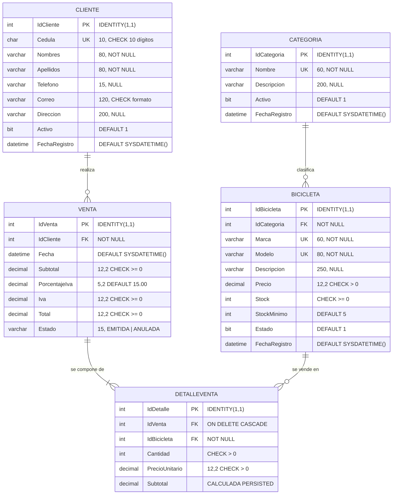

# Modelo Entidad-Relación — BikeStoreDB

**Proyecto:** Sistema de gestión BikeStore
**Motor:** Microsoft SQL Server 2019+
**Responsable:** Ledesma Rodríguez Josué David — *Base de datos / Arquitectura de datos*

Este documento describe el modelo de datos implementado en `database/01_BikeStoreDB.sql`.

---

## 1. Diagrama entidad-relación

---

## 2. Relaciones y cardinalidades

| Relación | Cardinalidad | Regla de borrado | Justificación |
|---|---|---|---|
| `Categoria` → `Bicicleta` | 1 : N | `RESTRICT` | No se elimina una categoría que tenga bicicletas. Se desactiva con `Activo = 0`. |
| `Cliente` → `Venta` | 1 : N | `RESTRICT` | Un cliente con historial de compras no se borra; se da de baja lógica. |
| `Venta` → `DetalleVenta` | 1 : N | `CASCADE` | El detalle no existe sin su cabecera: al borrar la venta, sus líneas se van con ella. |
| `Bicicleta` → `DetalleVenta` | 1 : N | `RESTRICT` | No se borra un producto que ya fue vendido: destruiría el historial. |

`DetalleVenta` es la **tabla asociativa** que resuelve la relación N:M entre `Venta` y `Bicicleta`, y añade los atributos propios de esa relación (`Cantidad`, `PrecioUnitario`).

---

## 3. Decisiones de diseño

**3.1 El precio se congela en el detalle.**
`DetalleVenta.PrecioUnitario` guarda una copia del precio vigente al momento de la venta, en lugar de leerlo por JOIN desde `Bicicleta`. Si mañana sube el precio del catálogo, las facturas ya emitidas conservan el valor con el que realmente se cobró. Sin esto, el historial de ventas se reescribiría solo cada vez que cambia una etiqueta de precio.

**3.2 El IVA se guarda por venta, no como constante.**
`Venta.PorcentajeIva` almacena la tarifa aplicada en esa fecha (15 % vigente en Ecuador). Si el porcentaje cambia por ley, los documentos anteriores no se alteran.

**3.3 `Subtotal` del detalle es una columna calculada persistida.**
`Subtotal AS (Cantidad * PrecioUnitario) PERSISTED` — el motor la calcula y la almacena físicamente. Es imposible que quede desincronizada con sus factores, y al estar persistida se puede indexar y agregar sin costo de recálculo.

**3.4 Bajas lógicas, no físicas.**
`Categoria.Activo`, `Bicicleta.Estado` y `Cliente.Activo` permiten retirar un registro de la operación diaria sin romper las claves foráneas que lo referencian desde el historial.

**3.5 `Venta.Estado` es texto restringido, no un `bit`.**
`CHECK (Estado IN ('EMITIDA','ANULADA'))` documenta el dominio en el propio esquema y deja espacio para estados futuros (`DEVUELTA`, `PENDIENTE`) sin migrar el tipo de dato.

**3.6 `StockMinimo` por producto.**
El umbral de reposición es un atributo de cada bicicleta, no un número fijo en el código: una bicicleta eléctrica de $3 000 se repone con 2 unidades, una infantil de $185 con 6. Es lo que permite el reporte de stock bajo del escenario 10.

---

## 4. Normalización

El modelo está en **tercera forma normal (3FN)**:

- **1FN** — todos los atributos son atómicos; no hay campos multivaluados ni grupos repetidos. Los productos de una venta viven en `DetalleVenta`, no en columnas `Producto1`, `Producto2`.
- **2FN** — no hay dependencias parciales. Todas las claves primarias son simples (`IDENTITY`), así que ningún atributo puede depender de parte de la clave.
- **3FN** — no hay dependencias transitivas. `Venta` no guarda el nombre del cliente (depende de `IdCliente`, no de `IdVenta`); se obtiene por JOIN o por la vista `vw_HistorialVentas`.

**Desnormalización controlada, y por qué:** `Venta.Subtotal`, `Venta.Iva` y `Venta.Total` son derivables sumando el detalle. Se almacenan de todas formas porque son valores contables: una vez emitido el documento, su total es un hecho histórico, no un cálculo que deba rehacerse cada vez que alguien consulta. El procedimiento `sp_RegistrarVenta` los calcula una sola vez, dentro de la misma transacción que inserta el detalle, de modo que no pueden quedar descuadrados.

---

## 5. Índices y su justificación funcional

| Índice | Escenario del enunciado que soporta |
|---|---|
| `IX_Bicicleta_Categoria` | 5 — buscar bicicletas por categoría |
| `IX_Bicicleta_Marca` | 5 — buscar bicicletas por marca |
| `IX_Bicicleta_Modelo` | Búsqueda por nombre/modelo |
| `IX_Bicicleta_Stock` | 10 — consultar bicicletas con stock bajo |
| `IX_Cliente_Apellidos` | Búsqueda de clientes por apellido |
| `IX_Cliente_Cedula` (UNIQUE) | Búsqueda de clientes por cédula |
| `IX_Venta_Cliente` | 9 — ventas realizadas por un cliente |
| `IX_Venta_Fecha` | 8 — historial de ventas ordenado por fecha |
| `IX_DetalleVenta_Venta` | Detalle de una venta |
| `IX_DetalleVenta_Bicicleta` | Historial de movimientos de un producto |

---

## 6. Integridad transaccional

El registro de una venta toca tres tablas y debe ser **atómico**: cabecera, detalle y descuento de inventario ocurren juntos o no ocurren. `sp_RegistrarVenta` lo garantiza así:

1. `SET XACT_ABORT ON` — cualquier error revierte la transacción completa.
2. Validaciones previas (cliente activo, detalle no vacío, cantidades positivas, productos existentes) **antes** de abrir la transacción, para no mantener bloqueos innecesarios.
3. `WITH (UPDLOCK, HOLDLOCK)` al verificar el stock: bloquea las filas de inventario involucradas hasta el `COMMIT`. Sin esto, dos ventas simultáneas del último artículo podrían leer ambas "stock = 1" y dejar el inventario en −1.
4. El `CHECK (Stock >= 0)` de la tabla es la última línea de defensa: aunque falle la lógica del procedimiento, el motor rechaza el descuento.
5. `BEGIN CATCH` con `ROLLBACK` y `THROW`, que propaga el error a la capa de datos con su número (50001–50006) para que la API lo traduzca al código HTTP correspondiente.
